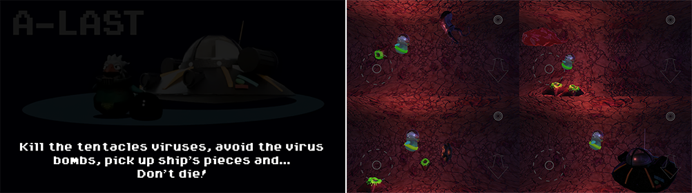
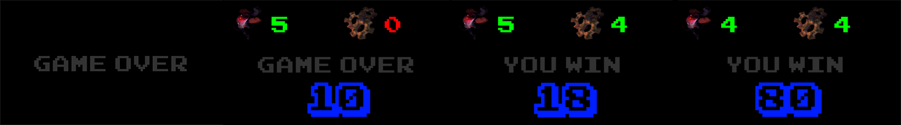
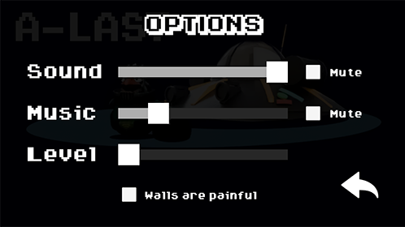
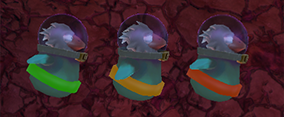
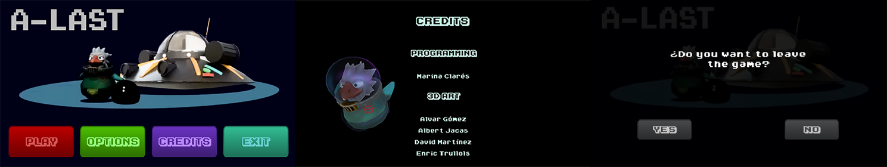

# A-LAST

A-Last is an android video game made in [GGJ2018](https://globalgamejam.org). In 48 hours my team an I developed this level, composing the music,desingning 3D, textures and programming.

This repo contains just the scripts, to see how A-last looks click [here](https://www.youtube.com/watch?v=Dk8opnEdnmc).

## Tehnologies

We create it using software as Substance Painter, Topogun, Blender, Photoshop, Illustrator...
___

## Simple look

GGJ2018 theme: "Transmission".

Accomplished diversifiers: 
- ART - Stranger Things
- DESIGN - Feathered Friends
- NARRATIVE - Babe, It Just Ain't Your Story

With this thematic, my team and I, decided to work in a imaginary  airborne transmited disease  . Main character is a micro chicken suited as astronaut, who should go througth the patient's veins killing the viruses and collecting the parts of his crashed airship.

Movement in this game is mostly 2D going continously to the right, but adding the z-axis.

Elements and enemies of the environment are procedurally positioned, so the level is different each time.

### Winning and loosing

Players must get gears, kill tentacles and avoid bombs to score, there is a minimun of these actions they have to perform  in order to win the game(see the red numbers in the picture).

You can set the speed and switch walls damage on an off, final score changes deppending on this settings. 

### UI and menus

The screen shows the joystic, attack button and -z/z movement. Chicken's belt goes from green to red simulating a lifebar. 

If the player completes the level or is killed, the scores screen or the gameover title is showed.

The different menus mixes arcade fonts and 3D images. As well as the game was made in two dimensinonal style with 3D elements and the z-axis momvement.

## Autors

Main roles in Global Game Jam 2018 were:
- Programming - MinaZhen
- 3D ART - Alvar Gómez / Albert Jacas / David Martínez / Enric Trullols
- 2D ART - Alvar Gómez / David Martínez / Enric Trullols
- ANIMATION - Albert Jacas
- MUSIC AND SFX - Enric Trullols / Albert Jacas
- NARRATIVE - Enric Trullols / David Martínez
- 3D OPTIMIZATION - MinaZhen
- UI/UX - MinaZhen

Complete credits can be seen [here](https://www.youtube.com/watch?v=qhC_sqwUv3A).